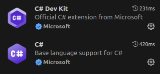

# Randstad---Backend-com-.NET-DIO

Repositório dedicado ao estudos de C4 e .NET, referentes ao curso da DIO.

[https://www.dio.me/](https://www.dio.me/)

Comandos:

- Comando para instalação
```bash
sudo snap install dotnet-sdk --classic --channel 8.0/stable
```

- Verificar versão:
```bash
dotnet --version
```

- Verificar infos:
```bash
dotnet --info
```

- Criando novo projeto no modo "console":
```bash
dotnet new console
```

- Executando projeto:
```bash
dotnet run
```

- Buildando projeto:
```bash
dotnet build
```

- Lista todos os tipos de projetos que é possível criar:
```bash
dotnet new --list
```

#### Extensões

